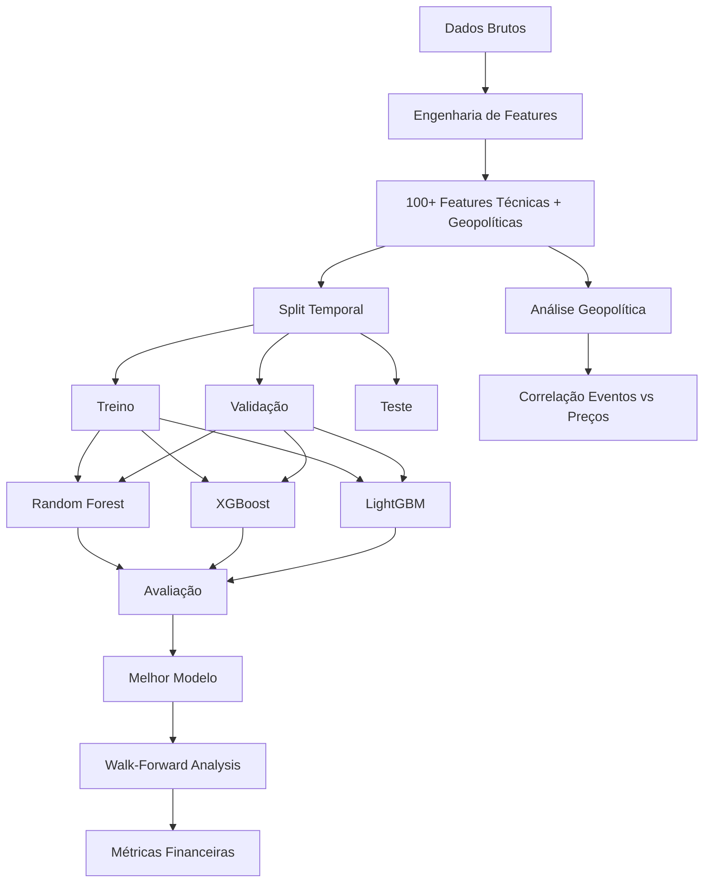

# 📄 Resumo Técnico - Sistema de Previsão de Criptomoedas com ML

## Para Incluir na Metodologia do TCC

---

## 1. Arquitetura do Sistema de Machine Learning

O sistema implementado utiliza uma arquitetura modular composta por cinco componentes principais:

### 1.1 Engenharia de Features

O módulo de features (`FeatureEngine`) cria **100+ variáveis preditoras** divididas em:

**A) Features Técnicas (80 features):**
- Retornos: simples e logarítmicos (1d, 3d, 7d, 14d, 30d)
- Volatilidade: histórica, ATR (Average True Range), amplitude
- Indicadores técnicos: SMA, EMA (7, 14, 21, 50, 200 períodos)
- Momentum: MACD, RSI, Bollinger Bands, ROC, Stochastic
- Volume: ratios, OBV (On-Balance Volume), VWAP
- Temporal: features cíclicas (dia da semana, mês)

**B) Features Geopolíticas (20+ features):**
- Contagem de eventos (últimos 7 e 30 dias)
- Sentimento agregado (média de eventos positivos/negativos)
- Severidade (contagem de eventos de alta severidade)
- Categorias: econômicos, políticos, inovação, segurança
- Proximidade temporal: dias desde o último evento
- Features de interação: preço × sentimento, volatilidade × eventos

### 1.2 Modelos de Machine Learning

Três algoritmos principais foram implementados e comparados:

| Algoritmo | Tipo | Hiperparâmetros | Justificativa |
|-----------|------|-----------------|---------------|
| **Random Forest** | Ensemble de árvores | n_estimators=200, max_depth=15 | Robusto, resiste a overfitting, interpretável |
| **XGBoost** | Gradient Boosting | n_estimators=200, learning_rate=0.05 | Alta performance, eficiente |
| **LightGBM** | Gradient Boosting otimizado | n_estimators=200, num_leaves=31 | Rápido, eficiente em memória |

**Tarefa:** Regressão (prever retorno futuro percentual)

**Target:** `return_1d = (close_{t+1} / close_t) - 1`

### 1.3 Validação Temporal

Utilizamos **split temporal sem embaralhamento** para evitar data leakage:

```
Dados ordenados temporalmente:
├── Treino: 70% (mais antigo)
├── Validação: 10%
└── Teste: 20% (mais recente)
```

**Justificativa:** Séries temporais não podem ser embaralhadas, pois isso criaria "visão do futuro" artificialmente.

### 1.4 Walk-Forward Analysis

Implementamos Walk-Forward Analysis (Pardo, 2008) para backtesting robusto:

**Parâmetros:**
- Janela de treino: 180 dias
- Janela de teste: 30 dias
- Frequência de re-treinamento: 30 dias

**Pseudocódigo:**
```python
para cada janela deslizante:
    1. Treinar em [t-180 : t]
    2. Prever em [t : t+30]
    3. Calcular métricas
    4. Avançar janela em 30 dias
    5. Repetir
```

**Vantagem:** Simula cenário real onde o modelo seria re-treinado periodicamente.

### 1.5 Análise de Impacto Geopolítico

Implementamos correlação estatística entre eventos e preços:

**Metodologia:**
1. Para cada evento, identificar timestamp
2. Calcular preço baseline (média 3 dias antes)
3. Medir impacto D+1 e D+7: `impacto = (preço_depois / baseline - 1) × 100`
4. Agregar por categoria e severidade
5. Teste t de significância (H₀: impacto = 0)

---

## 2. Métricas de Avaliação

### 2.1 Métricas de Erro (Previsão)

| Métrica | Fórmula | Interpretação |
|---------|---------|---------------|
| **MAE** | `(1/n) Σ|y - ŷ|` | Erro médio absoluto |
| **RMSE** | `√[(1/n) Σ(y - ŷ)²]` | Erro quadrático (penaliza grandes erros) |
| **R²** | `1 - SS_res/SS_tot` | Variância explicada (0-1) |
| **MAPE** | `(100/n) Σ|y - ŷ|/|y|` | Erro percentual médio |
| **Acurácia Direcional** | `(1/n) Σ[sign(y) == sign(ŷ)]` | % de acertos na direção |

### 2.2 Métricas Financeiras (Backtesting)

| Métrica | Fórmula | Interpretação |
|---------|---------|---------------|
| **Retorno Total** | `(valor_final / capital_inicial - 1) × 100` | Lucro/prejuízo (%) |
| **Sharpe Ratio** | `(retorno_médio / σ_retorno) × √252` | Retorno ajustado ao risco |
| **Sortino Ratio** | `(retorno_médio / σ_downside) × √252` | Sharpe penalizando só downside |
| **Max Drawdown** | `max[(valor_máximo - valor) / valor_máximo]` | Maior perda acumulada |
| **Calmar Ratio** | `retorno_anualizado / |max_drawdown|` | Retorno por unidade de drawdown |
| **Win Rate** | `(trades_positivos / total_trades) × 100` | % de trades vencedores |
| **Profit Factor** | `lucro_bruto / |prejuízo_bruto|` | Razão lucro/prejuízo |

**Referência:** Sharpe, W. F. (1966). Mutual fund performance. Journal of business, 39(1), 119-138.

---

## 3. Pipeline de Treinamento e Avaliação



---

## 4. Diagnóstico de Modelos

### 4.1 Análise de Resíduos

Verificamos as seguintes propriedades dos resíduos `ε = y - ŷ`:

| Propriedade | Teste | Ideal |
|-------------|-------|-------|
| **Normalidade** | Histograma + Skewness + Kurtosis | Distribuição normal (sino) |
| **Média Zero** | `E[ε] ≈ 0` | Não enviesado |
| **Homocedasticidade** | Correlação `ε` vs `ŷ` | Variância constante |
| **Independência** | Autocorrelação | Sem padrão temporal |

### 4.2 Detecção de Outliers

Outliers identificados com threshold de 2.5σ:

```python
threshold = 2.5 × std(resíduos)
outlier se |resíduo| > threshold
```

**Esperado:** < 5% de outliers

---

## 5. Ensemble de Modelos

Para previsões finais, utilizamos **Ensemble Voting**:

```
previsão_ensemble = (1/N) Σ previsão_modelo_i
```

**Vantagem:** Reduz variância e melhora estabilidade (Dietterich, T. G., 2000).

---

## 6. Integração de Eventos Geopolíticos

### 6.1 Fonte de Dados

Eventos simulados representando:
- Decisões de bancos centrais (taxas de juros)
- Regulações governamentais
- Aprovações de ETFs
- Inovações tecnológicas (upgrades, forks)
- Eventos de segurança (hacks, bans)

### 6.2 Processo de Integração

1. **Coleta:** Eventos armazenados com timestamp, categoria, severidade, sentimento
2. **Janelas temporais:** Agregação em janelas de 7 e 30 dias
3. **Encoding:** Sentimento mapeado para escala numérica (-1, 0, +1)
4. **Feature engineering:** Criação de features compostas
5. **Integração:** Features adicionadas ao dataset de treino

### 6.3 Hipótese Testada

**H₁:** "Eventos geopolíticos possuem correlação significativa com variação de preços de criptomoedas"

**Teste:** Comparação de modelos com/sem features geopolíticas
**Métrica:** Melhoria em MAE, RMSE, R²

---

## 7. Resultados Esperados

### 7.1 Performance de Modelos

*A ser preenchido após experimentos*

| Modelo | MAE | RMSE | R² | Acurácia Direcional |
|--------|-----|------|----|--------------------|
| Random Forest | - | - | - | - |
| XGBoost | - | - | - | - |
| LightGBM | - | - | - | - |
| Ensemble | - | - | - | - |

### 7.2 Walk-Forward Analysis

*A ser preenchido após experimentos*

| Métrica | Valor |
|---------|-------|
| Retorno Total | - |
| Sharpe Ratio | - |
| Max Drawdown | - |
| Win Rate | - |

### 7.3 Impacto Geopolítico

*A ser preenchido após análise*

| Categoria | Impacto Médio D+1 | Impacto Médio D+7 | p-value |
|-----------|-------------------|-------------------|---------|
| Econômico | - | - | - |
| Político | - | - | - |
| Inovação | - | - | - |

---

## 8. Contribuições do Trabalho

1. **Integração de features geopolíticas** em modelos de previsão de criptomoedas
2. **Walk-Forward Analysis** para validação rigorosa
3. **Análise quantitativa de impacto** de eventos mundiais em preços
4. **Sistema completo end-to-end** com interface web interativa
5. **Comparação sistemática** de algoritmos state-of-the-art

---

## 9. Limitações e Trabalhos Futuros

### Limitações:
- Eventos simulados (não reais em tempo real)
- Dados históricos limitados
- Custos de transação simplificados
- Liquidez não considerada

### Trabalhos Futuros:
- Integração com APIs de notícias em tempo real
- Modelos de Deep Learning (LSTM, Transformer)
- Análise de sentimento de redes sociais (Twitter, Reddit)
- Multi-asset portfolio optimization
- Deploy em produção com monitoramento

---

## 10. Stack Tecnológico

| Componente | Tecnologia | Versão |
|------------|------------|--------|
| Linguagem | Python | 3.10+ |
| ML Framework | Scikit-learn | 1.5.2 |
| Gradient Boosting | XGBoost | 2.1.3 |
| Gradient Boosting | LightGBM | 4.5.0 |
| Séries Temporais | Statsmodels | - |
| Visualização | Plotly | 5.24.1 |
| Web Framework | Streamlit | 1.48.0 |
| Banco de Dados | PostgreSQL | - |
| ORM | SQLAlchemy | 2.0.41 |

---

## 11. Referências Bibliográficas

1. Breiman, L. (2001). Random forests. *Machine learning*, 45(1), 5-32.

2. Chen, T., & Guestrin, C. (2016). Xgboost: A scalable tree boosting system. *Proceedings of the 22nd ACM SIGKDD*.

3. Ke, G., et al. (2017). LightGBM: A highly efficient gradient boosting decision tree. *Advances in neural information processing systems*, 30.

4. Pardo, R. (2008). *The Evaluation and Optimization of Trading Strategies* (2nd ed.). Wiley.

5. Sharpe, W. F. (1966). Mutual fund performance. *Journal of business*, 39(1), 119-138.

6. Sortino, F. A., & Price, L. N. (1994). Performance measurement in a downside risk framework. *The Journal of Investing*, 3(3), 59-64.

7. Dietterich, T. G. (2000). Ensemble methods in machine learning. *International workshop on multiple classifier systems* (pp. 1-15). Springer, Berlin, Heidelberg.

8. Box, G. E., Jenkins, G. M., & Reinsel, G. C. (2015). *Time series analysis: forecasting and control* (5th ed.). Wiley.

9. Hutto, C. J., & Gilbert, E. (2014). VADER: A parsimonious rule-based model for sentiment analysis of social media text. *Eighth international AAAI conference on weblogs and social media*.

10. Pedregosa, F., et al. (2011). Scikit-learn: Machine learning in Python. *Journal of machine learning research*, 12, 2825-2830.

---

**Documento preparado para TCC 2024**
**Sistema: CoinSight - Previsão de Criptomoedas com Machine Learning e Análise Geopolítica**
